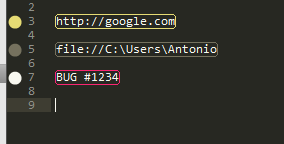
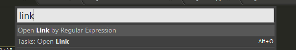

RegExLink
=========

A Sublime Text plugin that open links and commands formatting it using a regular expression.

With this kink of definition you can open a link direcly in your browser or open a filesystem path in explorer.
It's very useful to combine keyword with url so you can make a Google search typing something like GOOGLE:query or open 
the wikipedia page with a specific topic using WIKI:WikiPage.

I use it to trap something light BUG #1234 to open the bugtracker at the 1234 issue page.

You can define your custom regule expresion like in the following code. By default an url and a filesystem definition is
configured.

```
  // URL 
  { 
     "name" : "Url",
     "regex" : "(http://[^\\s]+)",
     "link" : "$1",                                     // all the link 
     "style": "string"                                  // string, invalid, variable, comment, variable.parameter
  },
  // Open a path like C:\Users\Antonio\Documenti using Explorer 
  { 
     "name" : "Filesystem",
     "regex" : "file://([^\\s]+)",
     "command" : "explorer c:\\$1",                     //you can specify a command
     "style": "comment"
  },
  // Search on Google 
  //{ 
  //   "name" : "Google",
  //   "regex" : "GOOGLE:([^\\s]+)", 
  //   "link" : "https://www.google.it/search?q=$1",    //you can specify a link transformation
  //   "style": "variable"
  //},
  //{ 
  //   "name" : "Wikipedia",
  //   "regex" : "WIKI:([a-zA-Z0-9]+)",
  //   "link" : "http://en.wikipedia.org/wiki/$1",
  //   "style": "string"
  //},
```

Automatically maches are highlighted with colour of the style, so you can see something like in the following screenshot.



To open the link, use the command *Open Link from Regular Expression*, al selected region (you can also open multiple link 
with one command) or what is under the caret will be launched. You can also use the entry in the contextual menu.



The command for shortcut association is *reg_ex_link*

## License
Copyright 2014-2014 [Antonio Riva](http://www.antonioriva.net)
